# 📊 CYD Resource Monitor — SYSTEM RESEARCH / NODE 01

[English](README.md) · **ภาษาไทย**

จอมอนิเตอร์ทรัพยากรเครื่อง PC/Mac บน **บอร์ด ESP32 พร้อมจอทัช 2.8 นิ้ว ราคาหลักร้อย** (ตระกูล CYD "Cheap Yellow Display") — สาย USB เส้นเดียวได้ทั้งไฟและข้อมูล ไม่ต้องตั้งค่า WiFi ไม่ต้องต่อสายเพิ่ม ไม่ต้องลง driver


<p align="center">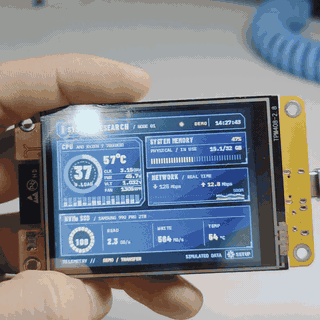</p>

**บนบอร์ดจริง:**

| ข้อมูลจริงจาก MacBook M1 | เดโม: GAMING | เดโม: TRANSFER |
|---|---|---|
| 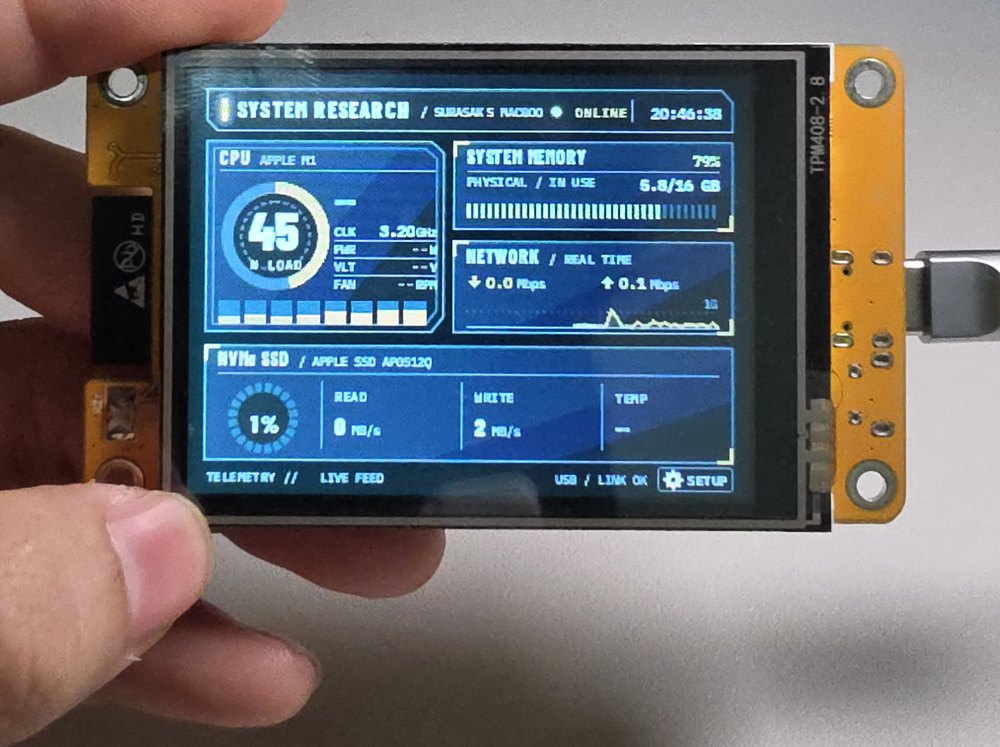 | 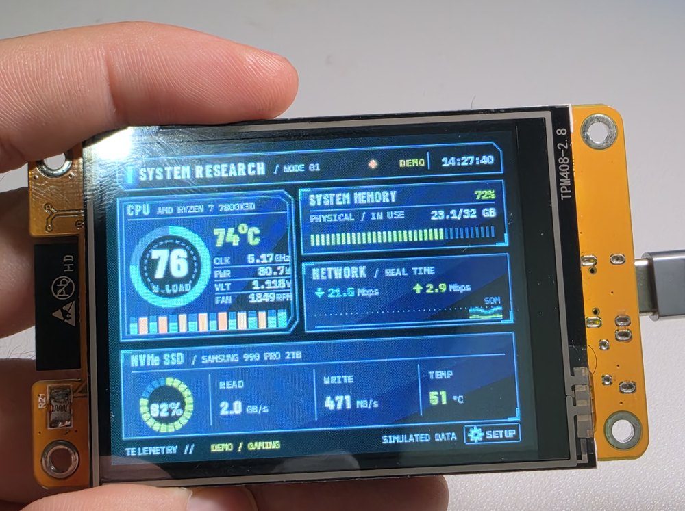 | 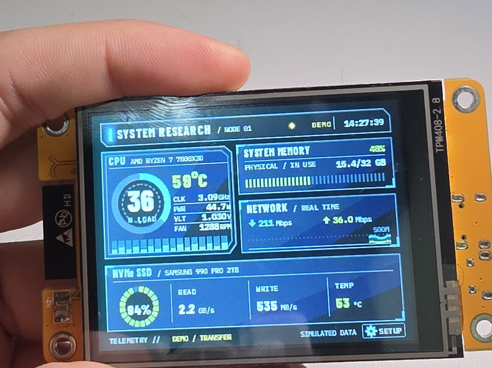 |

<sub>รูปข้อมูลจริงถ่ายก่อนอัปเดต agent ให้อ่านอุณหภูมิบน Apple Silicon ได้ ในรูปนั้นอุณหภูมิ CPU / NVMe จึงยังเป็น `--`</sub>

**ภาพเรนเดอร์จากโค้ด UI ชุดเดียวกัน** (`tools/host_preview` ตรงทุกพิกเซล):

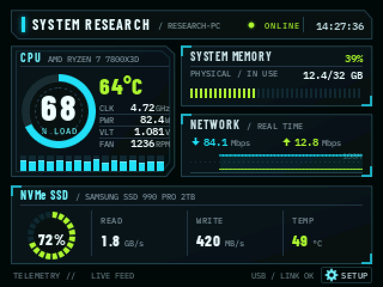

| ICE / LIME | VIOLET | AMBER |
|---|---|---|
| 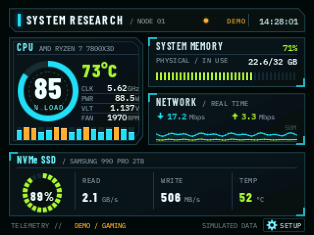 | 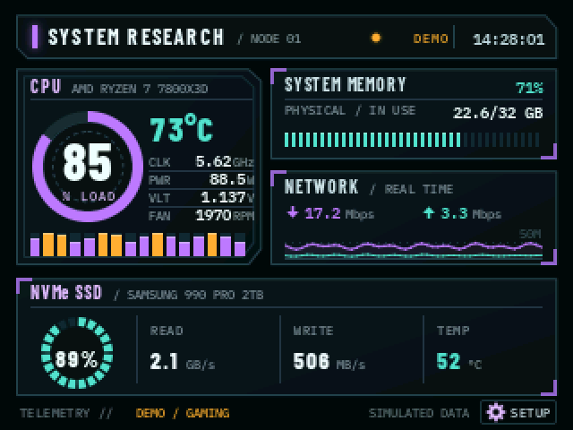 | 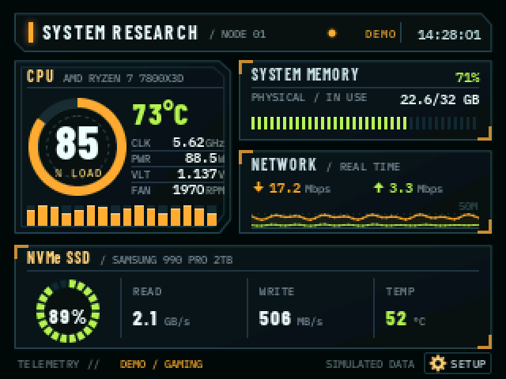 |

| | | |
|---|---|---|
| 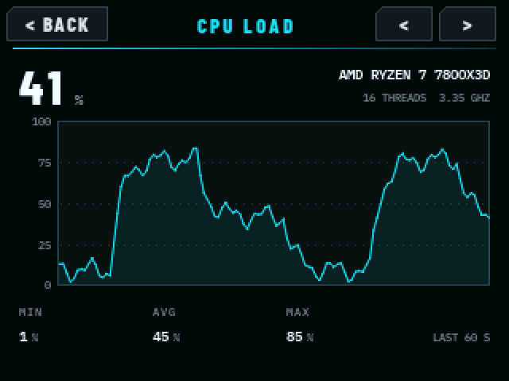 | 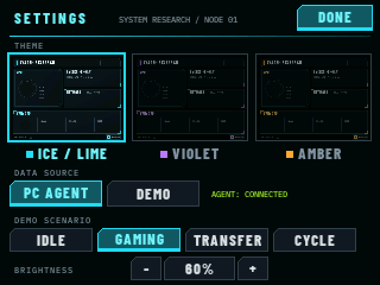 | 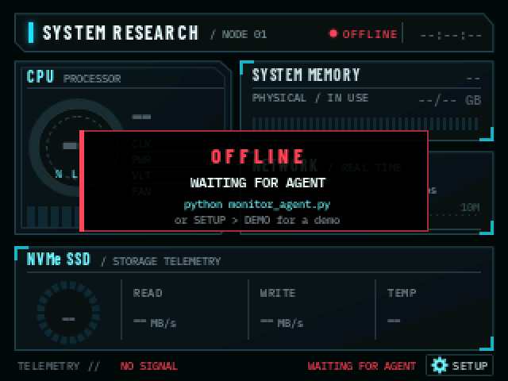 |
| แตะแผงไหนก็ได้ → กราฟย้อนหลัง 60 วินาที พร้อม MIN / AVG / MAX | ธีม, แหล่งข้อมูล, โหมดเดโม — บันทึกลง flash | agent ไม่ทำงาน → ขึ้นสถานะ OFFLINE ชัดเจน |

## ฟีเจอร์

- **หน้าจอ "SYSTEM RESEARCH"** (ดีไซน์อยู่ใน [`research-monitor/`](research-monitor/)) — header แสดงชื่อ node สถานะการเชื่อมต่อ และนาฬิกาของเครื่อง PC; **CPU** วงแหวนแสดง load %, อุณหภูมิ, **แท่ง load รายคอร์** และแถว clock / power / voltage / fan; **หน่วยความจำ** เป็นแถบแบ่งช่อง; **เครือข่าย** RX/TX หน่วย Mbps พร้อมกราฟเลื่อน; **NVMe** วงแหวน activity พร้อม read / write / อุณหภูมิไดรฟ์
- **ธีม 3 แบบ** ตามดีไซน์ — `ICE / LIME`, `VIOLET`, `AMBER` — สลับบนจอได้ และบันทึกลง flash
- **ข้อมูลตรงไปตรงมา**: ค่าไหนที่ PC ไม่ส่งมา หรือเก่าเกิน 2.5 วินาที จะแสดง `--` ถ้า agent หยุด header จะเป็นสีแดงและขึ้นแบนเนอร์ **OFFLINE / WAITING FOR AGENT** แล้วหายเองเมื่อข้อมูลกลับมา
- **โหมดเดโม** (Settings → DATA SOURCE → DEMO): ตัวจำลองในเครื่อง มีพรีเซ็ต IDLE / GAMING / TRANSFER ตามดีไซน์ หรือ CYCLE วนไปเรื่อยๆ — ไม่ต้องมี PC
- **หน้าประวัติ** — แตะ CPU / RAM / NET / NVMe เพื่อดูกราฟ 60 วินาที, MIN / AVG / MAX; ปุ่มลูกศรไปต่อที่อุณหภูมิ CPU และ **GPU load** (ชื่อ GPU, อุณหภูมิ, VRAM) ซึ่งเลย์เอาต์หลักไม่มีแผงให้
- **ไม่กระพริบ**: เฟรมและป้ายที่ไม่เปลี่ยนถูกเรนเดอร์ไว้ใน flash ล่วงหน้า วาดเฉพาะ widget สด และแต่ละส่วนจะถูกวาดใหม่ **เฉพาะเมื่อค่าเปลี่ยน** (หน้าจอนิ่งๆ ไม่ส่งพิกเซลเลย) ไม่ใช้ buffer เต็มจอ เพราะ CYD ไม่มี PSRAM
- การตั้งค่าทั้งหมดเก็บใน NVS flash ไม่หายแม้ถอดไฟ ไฟหลังจอเปิดเต็มตลอด เพราะ CYD ตัวนี้หรี่ไฟด้วย PWM ไม่ได้ (ดู [สถานะ](#status)) ถ้าบอร์ดที่ใช้หรี่ได้ เปิดปุ่มปรับความสว่างด้วย `BACKLIGHT_DIMMING 1`

## สถาปัตยกรรม

```
┌─────────────┐  JSON lines @ 2 Hz   ┌──────────────┐
│   PC / Mac   │ ──── USB serial ────▶│  CYD display  │
│ monitor_agent│      115200 baud     │   firmware    │
└─────────────┘                      └──────────────┘
```

โปรโตคอลเป็น line-delimited JSON ที่ไม่ผูกกับ transport ไม่ต้องลง driver ใดๆ เพราะชิป CH340 บนบอร์ดรองรับในตัวทั้ง macOS (Big Sur ขึ้นไป) และ Windows 10/11

### โปรโตคอล

JSON หนึ่งอ็อบเจกต์ต่อหนึ่งบรรทัด ทุก key ยกเว้นอ็อบเจกต์ระดับบน 4 ตัวเป็น optional — ถ้าไม่มี firmware จะแสดง `--` และไม่พังเมื่อ field หาย

```json
{"cpu":{"load":68,"freq":4720,"cores":16,"temp":64,"name":"AMD Ryzen 7 7800X3D","power":82.4,"volt":1.081,"fan":1236,"per_core":[72,61,69,63]},
 "ram":{"pct":38.8,"used":12.4,"total":32.0},
 "gpus":[{"name":"RTX 4070","load":54,"temp":61,"vram_used":6.3,"vram_total":12,"discrete":true}],
 "disk":{"pct":54,"act":72,"r":1843,"w":420,"temp":49,"model":"Samsung SSD 990 PRO"},
 "net":{"dl":10.03,"ul":1.52},
 "host":{"name":"research-pc","os":"win","clock":52056}}
```

| Key | ความหมาย | เพิ่มในเวอร์ชันนี้? |
|---|---|---|
| `cpu.load / freq / cores / temp` | %, MHz, จำนวน logical CPU, °C | ไม่ |
| `cpu.name / power / volt / fan` | ชื่อรุ่น, W, V, RPM | **ใช่** |
| `cpu.per_core` | load % รายคอร์ สูงสุด 16 ค่า (ถ้ามากกว่านี้จะเฉลี่ยรวมเหลือ 16) | **ใช่** |
| `ram.pct / used / total` | %, GiB, GiB | ไม่ |
| `gpus[]` | ชื่อ, load, temp, VRAM (การ์ดแยกขึ้นก่อน) | ไม่ |
| `disk.pct / r / w` | พื้นที่ใช้ไป %, อ่าน / เขียน MiB/s | ไม่ |
| `disk.act / temp / model` | busy %, °C, รุ่นไดรฟ์ | **ใช่** |
| `net.dl / ul` | MiB/s (จอแปลงเป็น Mbps ให้) | ไม่ |
| `host.name / os` | | ไม่ |
| `host.clock` | วินาทีนับจากเที่ยงคืนตามเวลาเครื่อง ใช้แสดงนาฬิกาที่ header | **ใช่** |

**ความเข้ากันได้**: firmware ข้าม key ที่ไม่รู้จัก ดังนั้น firmware เก่าใช้กับ agent ใหม่ได้ และ firmware ใหม่ใช้กับ agent เก่าได้ (แค่ power, voltage, fan, แท่งรายคอร์, อุณหภูมิ/activity ของไดรฟ์ และนาฬิกาจะขึ้น `--`) โดย `disk.pct` (พื้นที่ใช้ไป) **ไม่ถูกนำมาแสดงเป็น NVMe activity** โดยตั้งใจ

## เกี่ยวกับบอร์ด

โปรเจคนี้รันบนบอร์ดจอ ESP32 ขนาด 2.8 นิ้ว **ตระกูล CYD** ซึ่งมีผังขาตรงกับรุ่น `ESP32-2432S028R` ที่มีเอกสารอ้างอิงมากที่สุด — ค่าใน `platformio.ini` ตั้งตามผังขานี้ทั้งหมด

**👉 บอร์ดตัวที่ใช้จริงในโปรเจคนี้: [ดูที่ Shopee](https://s.shopee.co.th/30mqperiSK)** (พอร์ต USB-C, จอมีรหัส `TPM408-2.8`)

| ส่วนประกอบ | รายละเอียด |
|---|---|
| ชิป | ESP32-WROOM-32 ดูอัลคอร์ 240 MHz, flash 4 MB, ไม่มี PSRAM |
| จอ | ILI9341 ขนาด 2.8 นิ้ว 320×240, SPI ที่ 65 MHz |
| ทัชสกรีน | XPT2046 แบบ resistive (bit-bang: CLK 25, DIN 32, DOUT 39, CS 33) |
| USB-serial | CH340 — OS รองรับในตัว ไม่ต้องลง driver |

> ⚠️ บอร์ด CYD แต่ละล็อตไม่เหมือนกัน ถ้าสีเพี้ยนกลับด้าน ให้ flash environment อีกตัว: `pio run -e cyd-noinvert -t upload` (ค่าเริ่มต้น `esp32dev` เปิด `TFT_INVERSION_ON`) และถ้าจุดแตะไม่ตรง ให้แก้ค่า `touch.setCal(...)` ใน `src/main.cpp`

## เริ่มใช้งาน

### 1. Flash firmware

**ง่ายที่สุด: โหลดไฟล์สำเร็จรูปจาก [Releases](https://github.com/moomdate/CYD-Resource-Monitor/releases)** ใช้ไฟล์
`cyd-resource-monitor-esp32dev-factory.bin` แล้ว flash ที่ address `0x0` ไฟล์เดียวมีทั้ง bootloader, partitions และตัวโปรแกรม:

```bash
pip install esptool
esptool --chip esp32 --baud 460800 write_flash 0x0 cyd-resource-monitor-esp32dev-factory.bin
```

ถ้าสีกลับ (หน้าจอที่ควรมืดกลายเป็นสว่าง) ให้ใช้ `cyd-resource-monitor-cyd-noinvert-factory.bin` แทน เพราะจอ CYD มี 2 แบบ
ใช้โปรแกรม flash ESP บนเว็บเบราว์เซอร์ที่รับไฟล์เดียวที่ `0x0` ก็ได้
ถ้า flash แล้วขึ้น *"Unable to verify flash chip connection"* ให้ลดความเร็วลง (`--baud 115200`)

**หรือ build เองจาก source** (PlatformIO):

```bash
git clone https://github.com/moomdate/CYD-Resource-Monitor.git
cd CYD-Resource-Monitor
pio run -t upload                      # หรือ: pio run -e cyd-noinvert -t upload
```

ไม่ต้องตั้งค่าอะไร: ถ้ายังไม่รัน agent จอจะขึ้นแบนเนอร์ OFFLINE และเลือก *Settings → DEMO* เพื่อดู UI ด้วยข้อมูลจำลองได้

### 2. รัน agent บนเครื่องที่จะมอนิเตอร์

โหลดไฟล์สำเร็จรูปจาก [Releases](https://github.com/moomdate/CYD-Resource-Monitor/releases) — `cyd-monitor-agent-windows.exe`, `cyd-monitor-agent-macos` หรือ `cyd-monitor-agent-linux` — หรือรันจาก source:

```bash
cd agent
pip install -r requirements.txt
python monitor_agent.py          # หา port ของบอร์ดเองอัตโนมัติ
```

> หมายเหตุ macOS: ไฟล์จาก release ไม่ได้ code-sign — ครั้งแรกให้ right-click → Open

| ออปชัน | ใช้เมื่อ |
|---|---|
| `--list` | ดูรายชื่อ serial port |
| `--port COM5` | ระบุ port เอง |
| `--print` | ทดสอบพิมพ์ JSON โดยไม่ต้องต่อบอร์ด |
| `--interval 1` | ปรับความถี่ส่ง (ค่าเริ่มต้น 0.5 วินาที) |

### 3. การ์ดจอ (GPU) และอุณหภูมิ

อ่าน GPU load ได้**ทุกค่ายโดยไม่ต้องติดตั้งอะไรเพิ่ม** (โค้ดอยู่ใน `agent/hwinfo.py`)

| | NVIDIA | AMD | Intel | Apple |
|---|---|---|---|---|
| **Windows** | load, VRAM (PDH) · ได้ temp / power / clock / fan เพิ่มถ้าลง `nvidia-ml-py` | load, VRAM (PDH) · temp ต้องมี LHM หรือ `pyadl` | load, VRAM (PDH) · temp ต้องมี LHM | – |
| **Linux** | ครบ ถ้ามี `nvidia-ml-py` หรือ `nvidia-smi` | load, VRAM, temp, power, fan, clock (amdgpu sysfs) | load (RC6), clock, temp เฉพาะ Arc (i915 / xe sysfs) | – |
| **macOS** | – | load, VRAM (Mac ชิป Intel) | load (Mac ชิป Intel) | load + temp (Apple Silicon) |

| อุณหภูมิ | ทำยังไง |
|---|---|
| macOS Apple Silicon: CPU, GPU, SSD | ได้เลย (เซ็นเซอร์ IOHID ไม่ต้องใช้ sudo) |
| macOS ชิป Intel: CPU | `brew install smctemp` |
| Linux: CPU, ไดรฟ์, การ์ด AMD | ได้เลย (ผ่าน lm-sensors / psutil และ amdgpu hwmon) |
| Windows: อุณหภูมิ CPU / GPU / ไดรฟ์, CPU **power / voltage / fan**, activity ของไดรฟ์ | รัน [LibreHardwareMonitor](https://github.com/LibreHardwareMonitor/LibreHardwareMonitor) เปิด Options → Remote Web Server (agent ต่อ `localhost:8085` ให้เอง) เพราะ Windows ต้องใช้ kernel driver ถึงจะอ่านค่าพวกนี้ได้ |

ติดตั้งเพิ่มได้ถ้าต้องการ: `pip install nvidia-ml-py` (รายละเอียดการ์ด NVIDIA), `pip install pyadl` (อุณหภูมิการ์ด AMD บน Windows ที่ไม่มี LHM)
ส่วนที่อ่านช้าแยกไปทำใน thread เบื้องหลัง การส่งข้อมูล 2 ครั้งต่อวินาทีจึงไม่ต้องรอ ทั้ง agent ใช้ CPU ราว 0.7% ของ 1 core (วัดบน M1)

นอกจาก GPU แต่ละระบบให้ข้อมูลอะไรได้บ้าง:

| | Windows (+ LHM) | Windows (ไม่มี LHM) | macOS | Linux |
|---|---|---|---|---|
| CPU load, แต่ละ core, clock, RAM, network, read/write | ✅ | ✅ | ✅ | ✅ |
| อุณหภูมิ CPU | ✅ | – | ✅ Apple Silicon · Intel ต้องมี `smctemp` | ถ้ามี sensor |
| CPU power / voltage / fan | ✅ ถ้ามี sensor | – | – | เฉพาะ fan |
| อุณหภูมิ / รุ่นของไดรฟ์ | ✅ | – | ✅ Apple Silicon / รุ่น | ✅ |
| NVMe activity % | ✅ ค่าจริง | ~ ประมาณการ | ~ ประมาณการ | ✅ ค่าจริง |

"ประมาณการ" = ความเร็วอ่าน/เขียนเทียบกับค่าสูงสุดที่เคยเห็นตั้งแต่ agent เริ่มทำงาน (ขั้นต่ำ 150 MiB/s) ใช้ดูคร่าวๆ ว่าไดรฟ์ยุ่งแค่ไหน ไม่ใช่ค่าที่วัดจริง ข้อมูลที่ไม่มีจะขึ้น `--` บนจอ และ agent ไม่เคยส่ง `null`/`NaN`

## วิธีใช้งานบนจอ

| การแตะ | ผลลัพธ์ |
|---|---|
| Header หรือแถบล่าง (`SETUP`) | เปิดหน้า Settings |
| แผงใดแผงหนึ่ง (CPU / หน่วยความจำ / เครือข่าย / NVMe) | เปิดหน้าประวัติ 60 วินาทีของแผงนั้น |
| `<` `>` ในหน้าประวัติ | วนไป CPU load → CPU temp → หน่วยความจำ → GPU → เครือข่าย → NVMe |
| `BACK` / `DONE` | กลับหน้าหลัก |

**Settings**: ธีม (ภาพย่อจากอาร์ตจริง), แหล่งข้อมูล (`PC AGENT` / `DEMO`), โหมดเดโม (`IDLE` / `GAMING` / `TRANSFER` / `CYCLE`), ความสว่าง (20–100 %) เฉพาะเมื่อตั้ง `BACKLIGHT_DIMMING 1` และมีบรรทัดบอกว่าตอนนี้ agent เชื่อมต่ออยู่ไหม แม้จะอยู่ในโหมด DEMO

สถานะที่ header: **ONLINE** สีเขียว (ข้อมูลสด), **DEMO** สีเหลืองอำพัน (ตัวจำลอง), **OFFLINE** สีแดงกระพริบ (ไม่มีข้อมูลเกิน 2.5 วินาที)

> ตัวเลือก tile และแถบ RGB วิ่งของเฟิร์มแวร์เดิมถูกนำออก: หน้าหลักตอนนี้เป็นเลย์เอาต์เดียวตามดีไซน์ ส่วนธีม หน้าประวัติ รายละเอียด GPU และการบันทึกค่ายังอยู่ครบ

## การใช้งานประจำวัน & Auto-start

### Windows

ไฟล์ `.exe` เป็นแบบ **portable — ไม่ต้อง install** วางไว้ที่ไหนก็ได้ เสียบบอร์ด ดับเบิลคลิก จบ จะมีหน้าต่าง console เปิดขึ้นมาแสดง `connected to COM5` แล้วจอเริ่มขึ้นข้อมูลทันที

- **เฉพาะครั้งแรก**: SmartScreen จะเตือนเพราะไฟล์ไม่ได้ code-sign — กด *More info → Run anyway*
- **ไม่ต้องตั้งค่าอะไร**: agent หา COM port ของบอร์ด (CH340) เองอัตโนมัติ และรองรับการ์ด NVIDIA ในตัว มีแค่ sensor ที่อ่านผ่าน LHM (อุณหภูมิ CPU / power / voltage / fan, ข้อมูลไดรฟ์, การ์ด AMD / Intel) ที่ต้องเปิด LibreHardwareMonitor คู่กัน (ดูตารางด้านบน)
- **เปิดเครื่องใหม่ agent จะไม่รันเอง** — จอจะขึ้น *OFFLINE / WAITING FOR AGENT* จนกว่าจะเปิด `.exe` อีกครั้ง ถ้าอยากให้รันอัตโนมัติ:

| วิธี | ขั้นตอน | ผลลัพธ์ |
|---|---|---|
| **Startup folder** (ง่ายสุด) | `Win + R` → พิมพ์ `shell:startup` → Enter → คลิกขวาลาก `.exe` เข้าไป → *Create shortcut here* | รันทุกครั้งที่ login มีหน้าต่าง console ค้างไว้ (minimize ทิ้งได้) |
| **Task Scheduler** (เนียนกว่า) | สร้าง task, trigger *At log on*, action ชี้ไปที่ `.exe`, ติ๊ก *Hidden* | รันเงียบๆ เบื้องหลัง ไม่มีหน้าต่าง |

ถ้าใช้ LibreHardwareMonitor เพื่อดูอุณหภูมิ อย่าลืมติ๊ก *Run On Windows Startup* ของตัวมันเองด้วย

### macOS

รัน `./cyd-monitor-agent-macos` (ครั้งแรก: right-click → Open เพราะไฟล์ไม่ได้ sign) อยากให้รันตอน login: *System Settings → General → Login Items → กด +* แล้วเลือกไฟล์

### เกร็ดน่ารู้

Agent มี reconnect loop ในตัว — ถอดบอร์ด เสียบใหม่ หรือจอรีบูต **ไม่ต้องรัน agent ซ้ำ** มันต่อกลับให้เอง

> **macOS**: บน Apple Silicon อ่าน GPU load และอุณหภูมิ CPU / GPU / SSD ได้โดยไม่ต้องใช้ sudo แต่ไม่มี CPU power / voltage / fan ส่วน Windows ได้ครบทุกอย่างถ้ารัน LibreHardwareMonitor

## สำหรับนักพัฒนา

```bash
pio test -e native                 # unit test บนเครื่อง: parse JSON (รวมกรณี field หาย), model / staleness,
                                   # renderer ส่งเฉพาะส่วนที่เปลี่ยน, การแตะ settings + ประวัติ, ตัวจำลอง, อาร์ตธีม
python -m unittest discover -s agent -v            # เทสต์ของ agent (psutil ปลอม ไม่ต้องมีฮาร์ดแวร์)
pio run -e esp32dev                # build firmware (หรือ -e cyd-noinvert)
tools/host_preview/run.sh          # เรนเดอร์โค้ด UI จริงเป็น PNG ที่ tools/host_preview/out/ (ต้องมี Pillow)
```

**Host preview** คอมไพล์โค้ด UI, model, JSON parser และตัวจำลองตัวจริงของ firmware บนคอมพิวเตอร์ แล้วเขียน PNG ขนาด 640×480 (ทุกธีม, พรีเซ็ตเดโม, ตัวอย่าง JSON ของ agent ใน `tools/host_preview/samples/` รวมข้อความจาก agent เวอร์ชันเก่า, สถานะ offline / stale, หน้า settings และหน้าประวัติ) พร้อม `sim.gif` จึงปรับเลย์เอาต์ได้โดยไม่ต้องมีบอร์ด

### กระบวนการสร้างอาร์ต

```
tools/gen_chrome.py   → src/assets/bg_{ice,violet,amber}.h   กรอบ/ป้ายคงที่/ฉากหลังวงแหวนของแต่ละธีม (RGB565 อยู่ใน flash)
                      → src/assets/layout.h                  ตำแหน่งทุกสี่เหลี่ยม ใช้ร่วมกับ renderer ฝั่ง C++
tools/make_fonts.py   → src/fonts/*.h                        ฟอนต์ anti-alias ที่ blend กับพิกเซลจริง
```

ฟอนต์: ดีไซน์ใช้ **Barlow Condensed** และ **IBM Plex Mono** (SIL OFL) ถ้าไม่มีไฟล์ `tools/font_src/*.ttf` สคริปต์ `make_fonts.py` / `gen_chrome.py` จะใช้ฟอนต์ที่มาพร้อม Pillow แทน (ทำให้หนาและแคบลง) เพื่อให้ build ผ่านเสมอ — ถ้าต้องการหน้าตาตรงดีไซน์ ให้รัน `python tools/make_fonts.py --fetch` แล้ว `python tools/gen_chrome.py` จากนั้น commit header ที่สร้างใหม่ ถ้าจะแก้เลย์เอาต์ให้แก้ `LAYOUT` ใน `gen_chrome.py` แล้วรันใหม่ (ต้องมี Pillow + numpy)

CI (`.github/workflows/ci.yml`) รัน native test, build บอร์ดทั้งสองแบบ, เรนเดอร์ host preview และรันเทสต์ agent บน Linux, Windows และ macOS

## Release อัตโนมัติ (CI)

push tag ขึ้นต้นด้วย `v` แล้ว GitHub Actions จะ build และแนบไฟล์เข้า Release ให้เอง:

```bash
git tag v2.0.0 && git push origin v2.0.0     # tag ต้องตรงกับ FW_VERSION ใน src/config.h
```

| ไฟล์ | คืออะไร |
|---|---|
| `cyd-resource-monitor-<env>-factory.bin` | image เต็มสำหรับ flash ที่ `0x0` มีทั้ง `esp32dev` (จอที่ต้อง invert) และ `cyd-noinvert` |
| `cyd-resource-monitor-<env>.bin` | เฉพาะตัวโปรแกรม สำหรับ flash ที่ `0x10000` ทับของเดิม |
| `SHA256SUMS.txt` | checksum ของไฟล์ firmware |
| `cyd-monitor-agent-windows.exe` / `-macos` / `-linux` | agent แบบไฟล์เดียวจาก PyInstaller ไม่ต้องมี Python |

`tools/make_release.sh` build firmware ชุดเดียวกันในเครื่องได้

## โครงสร้างโปรเจค

```
agent/
├── monitor_agent.py       # Python agent (Windows / macOS / Linux)
└── test_monitor_agent.py
research-monitor/          # ดีไซน์: index.html (ต้นฉบับ), ภาพคอนเซ็ปต์, ไฟล์อ้างอิง LVGL
src/
├── config.h               # ขา, เวลา (30 fps, staleness 2.5 วินาที)
├── settings.h             # ธีม / แหล่งข้อมูล / โหมดเดโม / ความสว่าง
├── main.cpp               # รับ serial, แหล่งเดโม, ทัช, สลับหน้า, NVS, backlight
├── data/                  # telemetry.* (JSON parser + line reader), sim_source.* (เดโม)
├── ui/                    # monitor_model (staleness, หน่วย, ประวัติ), monitor_ui (renderer แบบวาดเฉพาะส่วนที่เปลี่ยน),
│                          # canvas (canvas RGB565 รายส่วน), settings_ui, detail_ui, widgets, theme
├── assets/                # สร้างอัตโนมัติ: ฉากหลังแต่ละธีม + layout.h
└── fonts/                 # สร้างอัตโนมัติ: ฟอนต์ AA
tools/                     # gen_chrome.py, gen_font.py, make_fonts.py, host_preview/
test/test_native/          # unit test บนเครื่อง
```

<a id="status"></a>
## สิ่งที่ยังไม่ได้ทดสอบกับบอร์ดจริง

เทสบน CYD จริงแล้ว: บูตได้, ราว 29 fps, วาดใหม่เฉพาะส่วนที่เปลี่ยน, รับข้อมูลจริงจาก agent บน macOS (M1), ทัชและการเปลี่ยนธีม สิ่งที่เจอบนบอร์ดจริง: ไฟหลังจอของบอร์ดนี้ดับทันทีเมื่อหรี่ด้วย PWM ต่ำกว่า 100% จึงตั้งให้เปิดไฟเต็มตลอดและซ่อนปุ่ม BRIGHTNESS (`BACKLIGHT_DIMMING` ใน `config.h`) ส่วน agent เทสกับเครื่องจริงบน macOS แล้ว (Apple Silicon: GPU load, อุณหภูมิ CPU / GPU / SSD) และเทสด้วยข้อมูลจำลองสำหรับ NVIDIA (NVML, nvidia-smi), AMD และ Intel (Linux sysfs), ตัวนับ PDH ของ Windows และ LibreHardwareMonitor **ยังไม่ได้รันบน PC Windows หรือ Linux จริง**

## สัญญาอนุญาต

[MIT](LICENSE) — เอาไปใช้ต่อได้ตามสบาย ถ้าให้เครดิตกลับมาก็จะดีมาก
